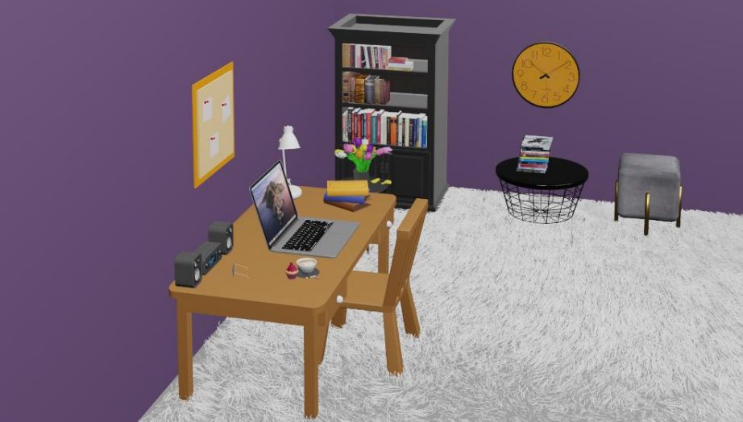

# Blender_ile_Calisma_Odasi_tasarimi
Bu proje, Blender 3D uygulaması kullanılarak tasarlanmış bir çalışma odasını içermektedir. Projede bulunan nesnelerden duvar, masa ve sandalye elle modellenmiştir. Diğer nesneler dış kaynaklardan alınarak projeye dahil edilmiştir.

-Duvar Yapımı-

Yeni Bir Proje Açın: Blender'ı açın ve yeni bir proje oluşturun (Ctrl + N).

Temel Küpü Ekleyin:
Shift + A tuşlarına basarak "Mesh" menüsünden "Cube" seçin.

Küpü Uzatın:
Küpü seçin (Sağ Tıklama) ve S tuşuna basarak ölçeklendirin.

Duvarın genişliğini ayarlamak için S + X, yüksekliği için S + Z yapın. Y ekseninde de uygun şekilde genişletin (S + Y).

Edit Mode'a Geçin:
Küp seçili iken Tab tuşuna basarak Edit Mode'a geçin.

Yüzey Seçimi:
3 tuşuna basarak yüzey (face) seçimini aktif edin.

Duvarın iç kısmını oluşturmak için bir yüzeyi seçin ve E tuşuna basarak ekstrüde edin. Böylece duvarın kalınlığını belirleyebilirsiniz.

Kapı ve Pencere Açmak:
Knife Tool (K) ile duvar üzerinde kesikler oluşturun. Kesiklerle kapı ve pencere yerlerini belirleyin.
Yüzeyleri seçerek X tuşuna basın ve Delete menüsünden "Faces" seçin.

Materyal Uygulama:
Tab tuşu ile Object Mode'a geri dönün.
Shading sekmesine geçin ve yeni bir materyal oluşturun. Renk ve dokularla duvarın görünümünü ayarlayın.

-Masa Yapımı-

Temel Küp ile Başlayın:
Shift + A tuşlarına basarak "Mesh" menüsünden "Cube" ekleyin.

Masa Yüzeyini Şekillendirin:
S tuşu ile küpü ölçeklendirin. X ekseninde genişletip (S + X), Y ekseninde uzunlaştırın (S + Y). Kalınlığı Z ekseninde ayarlayın (S + Z).

Edit Mode'a Geçin:
Küp seçili iken Tab tuşuna basarak Edit Mode'a geçin.

Masa Ayaklarını Oluşturun:
Shift + A tuşlarına basarak dört yeni küp ekleyin.
Bu küpleri ince ve uzun olacak şekilde ölçeklendirin (S tuşu ve ardından Z ekseni için S + Z).
Küpleri masa yüzeyinin dört köşesine yerleştirin (G tuşu ile taşıma yaparak).

Masa Ayaklarını Bağlayın:
Ayakları seçin ve Ctrl + J ile birleştirin.

Materyal Uygulama:
Shading sekmesine geçin ve masa için ahşap veya metalik bir materyal oluşturun.

-Sandalye Yapımı-

Temel Küp ile Başlayın:
Shift + A ile yeni bir küp ekleyin.

Oturma Kısmını Şekillendirin:
S tuşu ile küpü ölçeklendirin. X ve Y eksenlerinde genişletin, Z ekseninde inceltin.

Edit Mode'a Geçin:
Tab tuşuna basarak Edit Mode'a geçin.

Sandalyenin Ayaklarını Oluşturun:
Shift + A ile dört yeni küp ekleyin ve bunları ince ve uzun olacak şekilde ölçeklendirin (S tuşu ve ardından Z ekseni için S + Z).
Ayakları oturma kısmının altına yerleştirin (G tuşu ile taşıma yaparak).

Sırtlık Ekleyin:
Shift + A ile yeni bir küp ekleyin. Sırtlık için bu küpü Z ekseninde uzun olacak şekilde ölçeklendirin (S + Z).
Sırtlık kısmını oturma kısmının arkasına yerleştirin.

Sandalyeyi Birleştirin:
Tüm parçaları seçin ve Ctrl + J ile birleştirin.

Materyal Uygulama:
Shading sekmesine geçin ve sandalye için uygun bir materyal oluşturun. Kumaş veya plastik görünüm elde edebilirsiniz.

-Diğer Nesneler-

Projede kullanılan diğer nesneler (pano, kitaplık, halı, sehpa, bilgisayar, radyo vb.) dış kaynaklardan alınmıştır ve projeye Blender'ın Append veya Import fonksiyonları kullanılarak eklenmiştir.

